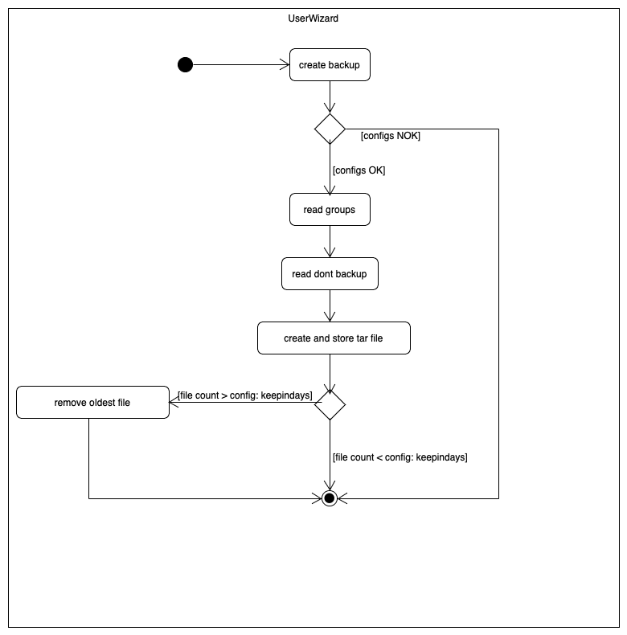

# Projekt Dokumentation

[[_TOC_]]

## Solution design

Based on the analysis, the following solution design was created.

### Calling the scripts

**Script 1:**

The file will be accessible as a command. The installation will contain moving the file to a folder in the users $PATH.

When calling the file, by default no path to the file with the users needs to befined. The script assumes that the file that is needed is in the current directory wiht the name `userwizzard.users.conf`. However it is possible to define a file path to any file.

As an optional parameter it will be possible to enter wether the script should run in controlled mode or not. By default this is disabled.

**Script 2:**

The script is executed in a cronjob. The cronjob is always executed at a certain time (defined in the cronjob configs by the user). All configurations do not have to be passed as parameters, but can be written into the config files.

### Activity Script 1


### Activity Script 2​

​

## Configrations

All our configuaration files shall be stored in `/etc/userwizzard/`

### Configs Script 1

**directorytemplate.conf.sample**

```
/documents/git/school/projects/122
/documents/git/school/projects/156
/documents/git/school/math
/documents/git/school/english
/documents/git/school/sports
/movies
```

**userwizzard.users.conf**

```
loris sudo Loris Polenz
lenny docker Lenny Lam
nominatim postgres Nominatim User
```

### Configs Script 2

**backup.config.sample**

```
<groupname>
/path/
name

```

**dontbackup.config.sample**

```
<groupname>
/path/
name
```

**backupdata.config.sample**

```

filename=NameOfTheFile-{timestamp}
keepindays=5
backuplocation=/backup

```

## Abgrenzungen zum Lösungsdesign

TODO: Nachdem das Programm verwirklicht wurde, hier die Unterschiede von der Implementation zum Lösungsdesign beschreiben (was wurde anders gemacht, was wurde nicht gemacht, was wurde zusaetzlich gemacht)
