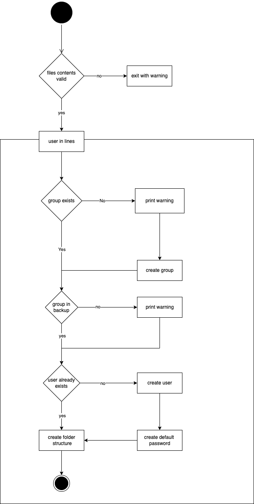

# Projekt Dokumentation

[[_TOC_]]

## Solution design

Based on the analysis, the following solution design was created.

### Calling the scripts

**Script 1:**

The file will be accessible as a command. The installation will contain moving the file to a folder in the users $PATH.

When calling the file, by default no path to the file with the users needs to befined. The script assumes that the file that is needed is in the current directory wiht the name `userwizzard.users.conf`. However it is possible to define a file path to any file.

As an optional parameter it will be possible to enter wether the script should run in controlled mode or not. By default this is disabled.

**Script 2:**

The script is executed in a cronjob. The cronjob is always executed at a certain time (defined in the cronjob configs by the user). All configurations do not have to be passed as parameters, but can be written into the config files.

### Activity Script 1



### Activity Script 2​

​

## Configrations

All our configuaration files shall be stored in `/etc/userwizzard/`

### Configs Script 1

**directorytemplate.conf.sample**

```
/documents/git/school/projects/122
/documents/git/school/projects/156
/documents/git/school/math
/documents/git/school/english
/documents/git/school/sports
/movies
```

**userwizzard.users.conf**

```
loris sudo Loris Polenz
lenny docker Lenny Lam
nominatim postgres Nominatim User
```

### Configs Script 2

**backup.config.sample**

```
<groupname>
/path/
name

```

**dontbackup.config.sample**

```
<groupname>
/path/
name
```

**backupdata.config.sample**

```

filename=NameOfTheFile-{timestamp}
keepindays=5
backuplocation=/backup

```

## Abgrenzungen zum Lösungsdesign

We chose to define our config files not in /etc/ but in etc/. This means our scripts run only within the directory they are intendet.

The construction of the config files at the beginning were much too complicated. Therefore we had to switch to another construction, which was technically much easier for me to implement than the previously planned. Due to two seperate scripts one of the scripts had to be changed to fit the new config files.

Overall we were able to create the scripts with a good functionality and like we planned it in the above files.
