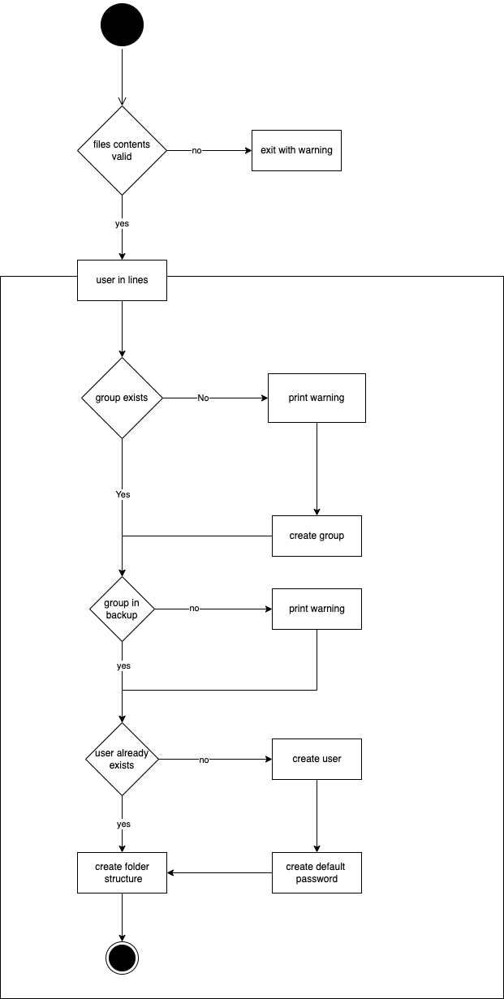

# Projekt Dokumentation

[[_TOC_]]

## Lösungsdesign

Anhand der Analyse wurde folgendes Lösungsdesign entworfen.

### Aufruf der Skripte

The file will be accessible as a command. The installation will contain moving the file to a folder in the users $PATH.

When calling the file, by default no path to the file with the users needs to befined. The script assumes that the file that is needed is in the current directory wiht the name `userwizzard.users.conf`. However it is possible to define a file path to any file.

As an optional parameter it will be possible to enter wether the script should run in controlled mode or not. By default this is disabled.

As of now the script will need to be manually initialized by a user.

TODO: schreiben sie wie die Skripte aufgerufen werden sollen (d.h. welche Parameter werden übergeben, gibt es Interaktionen mit dem Skript, läuft es automatisch täglich ab?)

### Ablauf der Automation



### Konfigurationsdateien

All our configuaration files shall be stored in `/etc/userwizzard/`

The template for the home directory needs to contain on every line a leaf path. For example:

```
/documents/git/school/projects/122
/documents/git/school/projects/156
/documents/git/school/math
/documents/git/school/english
/documents/git/school/sports
/movies
```

## Abgrenzungen zum Lösungsdesign

TODO: Nachdem das Programm verwirklicht wurde, hier die Unterschiede von der Implementation zum Lösungsdesign beschreiben (was wurde anders gemacht, was wurde nicht gemacht, was wurde zusaetzlich gemacht)
